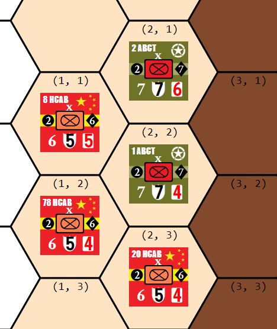

# About
Next war is a hex and counter, strategy wargame played on a tabletop. The game seeks to simulate potential near-future conflicts via the use of detailed rules that model real-world, operational-level combat in the 21st century. This web app aims to recreate the Next War board game as a modern single-page-application web app, to facilitate online play within our small community, and easier learning of the (extremely) complex rules.

For those new to the Next War series, rules can be found on the publisher's (GMT Games) website 

## In progress

Step losses and effects of damage 

## To do next

* visual movement range indicator
* automatic phase change
* visual indication of which units are participating in combat
* Roads and their effects on movement

## Done 
* map graphics created
* unit graphics created
* SVGs converted to vue components
* programmatic SVGs
* dynamic counter creation and elimination
* movement system logic 
* combat system logic 
* game phases 
